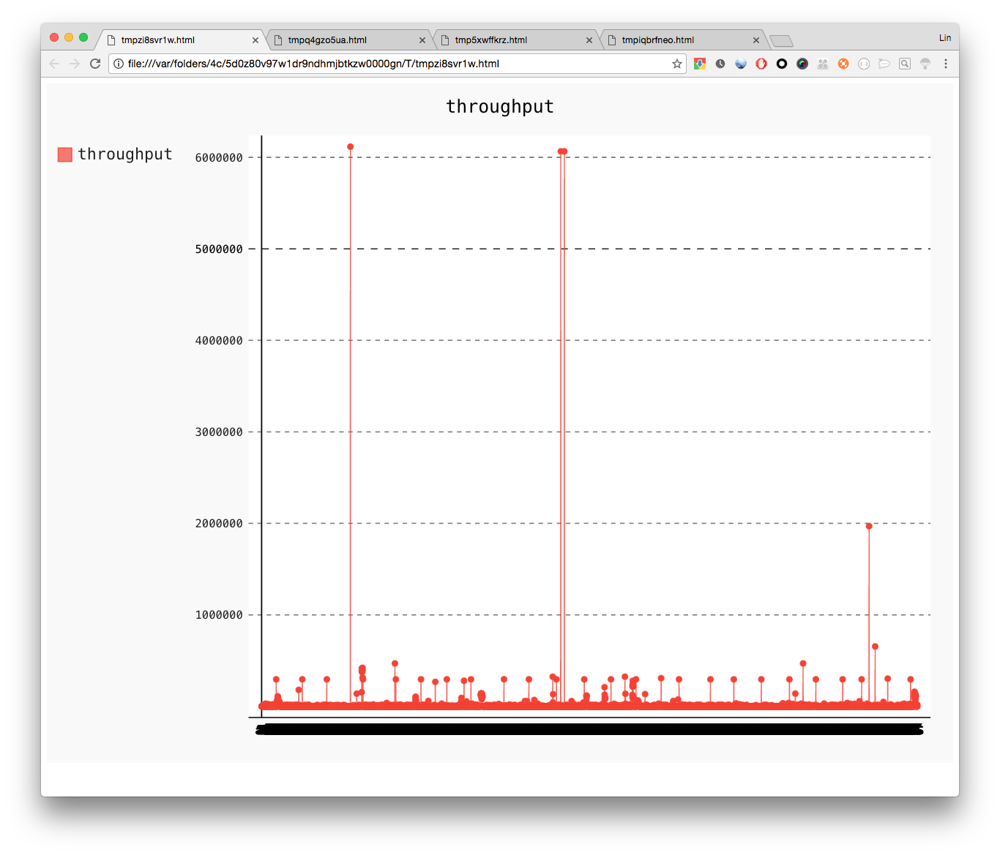
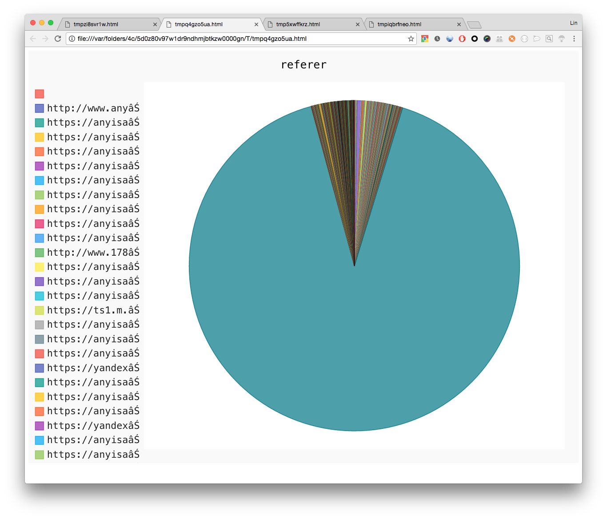
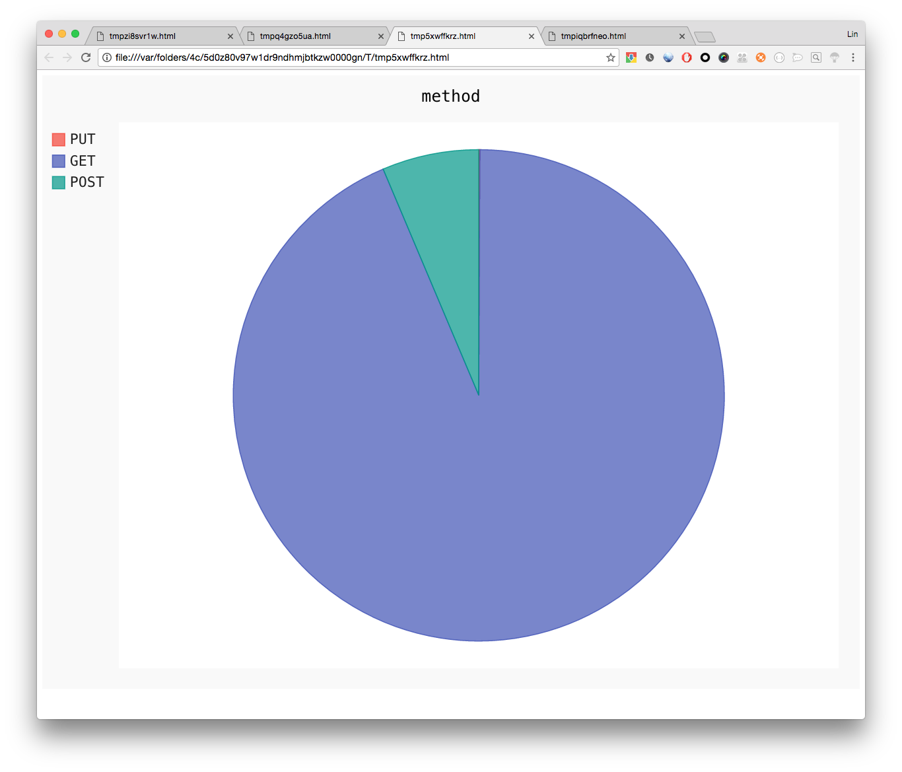
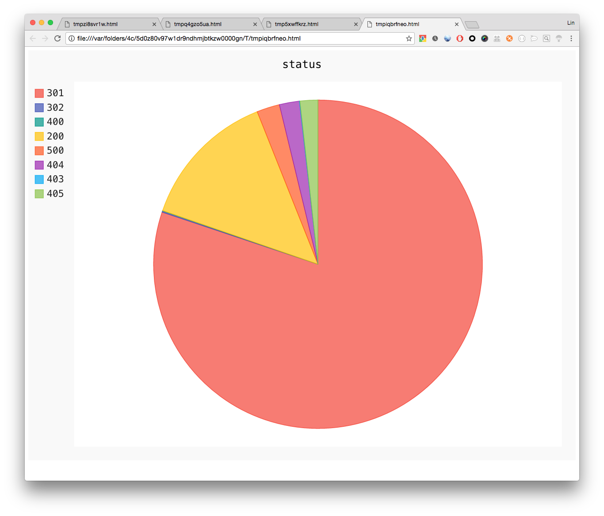

# Python 学习: 简单日志分析

很多时候我们可以通过 `ELK` 来处理日志并分析展现, 但是 `ELK` 实在太占资源了, 我们也可以写一个脚本来实现 `apache/nginx` 日志的简单分析.

我们的日志格式如下, 简单的 `apache` 日志, 没有经过处理.

```
'112.90.82.139 - - [11/Dec/2016:12:58:22 -0500] "GET / HTTP/1.1" 301 193 "-" "DNSPod-Monitor/2.0"'
```

## 代码解析.

```python
import sys
import re
import datetime
import pygal

#首先我们需要解析日志文件, 当然通过正则表达式来做了, 我们先得写一个通用的 pattern 来解析日志.
pattern = r'(?P<ip>\d{1,3}\.\d{1,3}\.\d{1,3}\.\d{1,3}) - - \[(?P<date>.*)\] \"(?P<method>\w+) (?P<url>\/.*) (?P<version>\HTTP/.*)\" (?P<status>\d{3}) (?P<size>\d+) \"(?P<referer>.*)\" \"(?P<ua>.*)\"'


#定义一个生成器函数, 从文件中读取行.
def read_log(path):
    with open(path) as f:
      yield from f


#定义一个生成器函数, 解析从文件中读取的行.
def parse(path):
    o = re.compile(pattern) #编译一下 pattern
    for line in read_log(path):
      try:
          m = o.search(line)
          data = m.groupdict()
          data['date'] = datetime.datetime.strptime(data['date'], '%d/%b/%Y:%H:%M:%S %z') #将之前ISO8061的日期格式转换成 datetime 格式.
          yield data  #返回 data
      except AttributeError:  #异常处理, 如果没有匹配到, 则 pass
          pass

#定义一个count函数, 专门为每个时间点的数据进行计数, 并将计数结果返回.
def count(key, data):
    if key not in data:
        data[key] = 0
        data[key] += 1
    return data


#定义 analyze 函数, 分析日志.
def analyze(path):
  result = {} #初始化一个字典, 存储返回值.

  #定义一个返回初始值的函数, 包含了要分析的字段.
  def init_data():
      return {
        'throughput': 0,
        'count': 0,
        'status': {},
        'url': {},
        'referer': {},
        'method': {}
        }

  for item in parse(path):
      time = item['date'].strftime('%Y%m%d%H%M')
      if time not in result.keys(): #如果这个时间戳不存在result 的 key中, 那么初始化.
          result[time] = init_data()
          data = result[time]
      for key, value in data.items():
          if key != 'throughput' and key != 'count':
              data[key] = count(item[key], value) #匹配字段调用 count 函数计数, 返回字典更新时间点的数据.
          elif key == 'throughput':
              data[key] += int(item['size'])  #如果 key 为 throughput, 叠加计算流量.
          else:
              data[key] += 1
  return result


def sum_count(key, data):
    result = {}
    filter_data = [ x[1][key] for x in data ]
    for item in filter_data:
        for key in item.keys():
            if key not in result:
                result[key] = 0
            result[key] += 1
    return result


def render_line(name, labels, data):  #可以通过 pygal 画图来展示, throughput比较适合条形图
    line_chart = pygal.Line()
    line_chart.title = name
    line_chart.x_labels = labels
    line_chart.add(name, data)
    line_chart.render_in_browser()


def render_pie(name, data): #render pie, 一些 item 比较适合扇形图
    pie_chart = pygal.Pie()
    pie_chart.title = name

    for key, value in data.items():
        pie_chart.add(key, value)
    pie_chart.render_in_browser()


def main():
    data = analyze(sys.argv[1])
    rs = list(data.items())
    rs.sort(key=lambda x: x[0]) #对时间进行排序, 也可以一开始用 OrderedDict
    throughput = [x[1]['throughput'] for x in rs]
    labels = [x[0] for x in rs]
    render_line('throughput', labels=labels, data=throughput)
    analyze_items = ['referer', 'method', 'status'] #定义要 render pie 的 item
    for item in analyze_items:
        filter_data = sum_count(item, rs)
        render_pie(item, filter_data)


if __name__ == '__main__':
    main()

```

## 使用效果

```
$ pip install lxml pygal  #需要安装两个第三方库.

$ python test.py access_log #指定日志文件, 由于这里我们 render_in_browser, 所以会直接跳出浏览器, 如果不想直接跳转浏览器, 也可以写到文件中.
```

> 一些图片可能因为数据量太大, 所以不怎么好看...










## 问题分析

这个脚本还有很多问题, 例如:

  * 不能同时处理多个文件
  * 效率不高
  * 没有将数据持久存储
  * 图太丑

下一篇笔记, 将使用 `influxdb` 存储数据, `grafana` 进行展示, 之后再介绍多线程多进程的处理方式.
