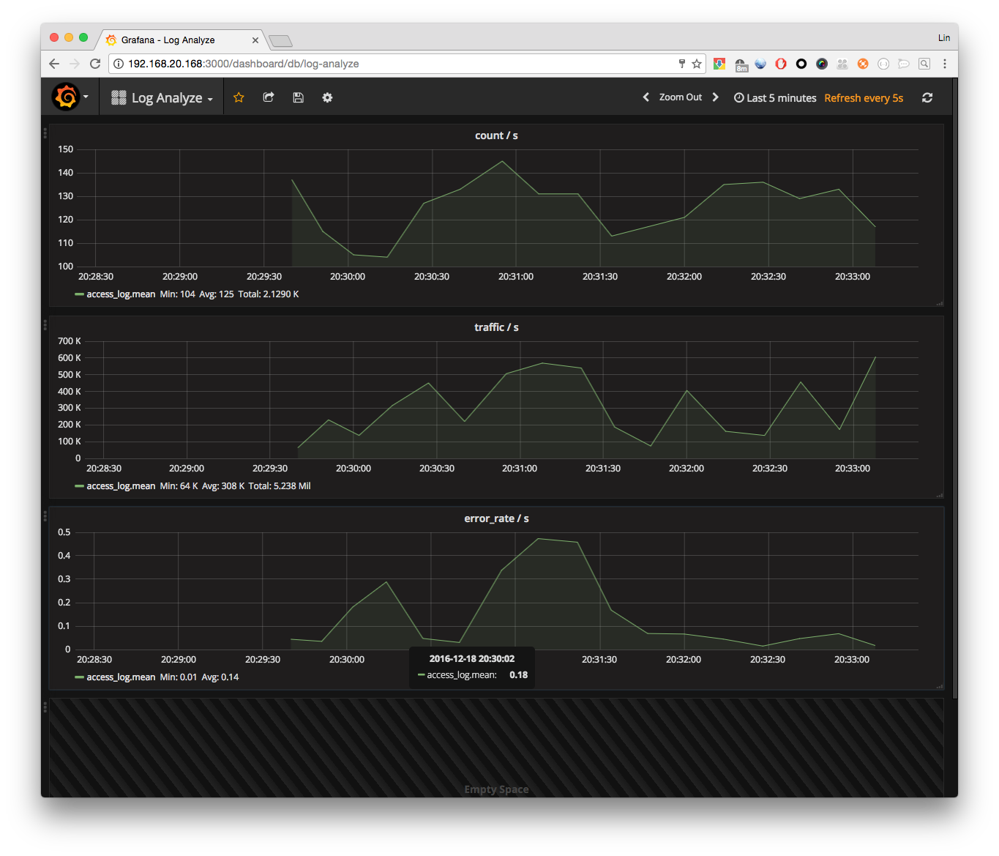

# Python 学习: 简单日志分析(2), 通过 `Influxdb` 存储数据, `grafana` 展现.

这次我们使用 `Influxdb` 来存储监控指标, 解决数据没有持久存储的问题, 在使用 `grafana` 来展示数据, 由于很多处代码和上篇笔记相同, 所以一些地方就不注释了.

这个脚本实现了以下功能.

  * 实时处理日志数据流并聚合
  * 存储数据到 `influxdb`
  * 通过 `grafana` 展示

## 代码解析.

```python
import threading
import requests
import os
import sys
import datetime
import re
import logging

pattern = r'(?P<ip>\d{1,3}\.\d{1,3}\.\d{1,3}\.\d{1,3}) - - \[(?P<date>.*)\] \"(?P<method>\w+) (?P<url>\/.*) (?P<version>\HTTP/.*)\" (?P<status>\d{3}) (?P<size>\d+) \"(?P<referer>.*)\" \"(?P<ua>.*)\"'
event = threading.Event() #实例化一个全局 event 对象
INFLUXDB_ADDRESS = 'http://192.168.20.168:8086/write' #指定 influxdb write url, 因为这里对 influxdb 操作不多, 所以没有调用 influxb python api.
logging.basicConfig(level=logging.INFO, format='%(asctime)s %(levelname)s  - %(message)s')  #logging 基本配置, 可查阅文档.


def read_log(path):
    file_size = os.stat(path).st_size   #这次我们需要从文件末尾开始读, 并且实时处理写入数据
    offset = file_size  #通过计算文件总大小来设定 offset 值, 以便能够直接到文件末尾.
    while not event.is_set():
        with open(path) as f:
            if offset > os.stat(path).st_size:  #防止出现日志被清空情况, 如果 offset 大于文件大小, 则设置 offset 为0, 即从文件开头重读.
                offset = 0
            f.seek(offset)
            yield from f
            offset = f.tell()
        event.wait(0.001)   #通过 event.wait 来做流控, 每 0.001 秒返回一次数据.


def parse(path):  #上篇笔记解释过 , 这里未做改动. 遂不注释.
    o = re.compile(pattern)
    for line in read_log(path):
        m = o.search(line)
        if m:
            data = m.groupdict()
            data['date'] = datetime.datetime.strptime(data['date'], '%d/%b/%Y:%H:%M:%S %z')
            yield data


def agg(path, interval=10): #定义聚合函数, 聚合数据并发往 influxdb, 设定发送间隔, 默认每十秒发送一次数据
    # 初始化要聚合的条目.
    count = 0
    traffic = 0
    error = 0
    start = datetime.datetime.now()  #获取当前时间.
    for item in parse(path):
        count += 1
        traffic += int(item['size'])
        if int(item['status']) >= 400:  #如果 status code 大于 400, 即判定为 error
            error += 1
        current = datetime.datetime.now() #获取当前时间.
        if (current - start).total_seconds() > interval:   #如果 current - start 时间大于 interval, 默认十秒, 就处理数据并发往 influxdb
            error_rate = error/count  #算出错误率.
            send(count, traffic, error_rate)  #调用 send 函数发送数据.
            # 重置条目的值.
            count = 0
            traffic = 0
            error = 0
            start = datetime.datetime.now() #重置 start time


def send(count, traffic, error_rate):
    logging.info('Send')  #发送前打印日志
    line = 'access_log count={},traffic={},error_rate={}'.format(count, traffic, error_rate)  #format 要发送的 data
    logging.info(line)  #打印发送日志
    res = requests.post(INFLUXDB_ADDRESS, data=line, params={'db': 'loganalyze'}) #调用 requests 库发送 write 请求.
    if res.status_code >= 300:  #如果 status code 大于300, 打印返回值.
        print(res.content)


if __name__ == '__main__':
    try:
        agg(sys.argv[1])
    except KeyboardInterrupt: #捕获 KeyboardInterrupt 异常, 优雅退出.
        event.is_set()
```

## 使用效果

我们需要创建一个和指定数据库名相同的数据库.

```shellscript
$ influx #进入 influxdb 命令行

> CREATE DATABASE loganalyze;
```

```shellscript
$ python test.py g.log #指定 log 文件进行流式分析.

2016-12-18 20:29:40,291 INFO  - Send
2016-12-18 20:29:40,291 INFO  - access_log count=137,traffic=64003,error_rate=0.043795620437956206
2016-12-18 20:29:51,002 INFO  - Send
2016-12-18 20:29:51,002 INFO  - access_log count=115,traffic=230104,error_rate=0.034782608695652174
2016-12-18 20:30:01,717 INFO  - Send
2016-12-18 20:30:01,717 INFO  - access_log count=105,traffic=137470,error_rate=0.18095238095238095
2016-12-18 20:30:14,283 INFO  - Send
2016-12-18 20:30:14,284 INFO  - access_log count=104,traffic=315871,error_rate=0.28846153846153844
```

**grafana**



## 问题分析

这个脚本还有很多问题, 例如:

  * 不能实时处理多个文件
  * 效率太低

下一篇笔记, 将介绍多线程多进程的处理方式.
