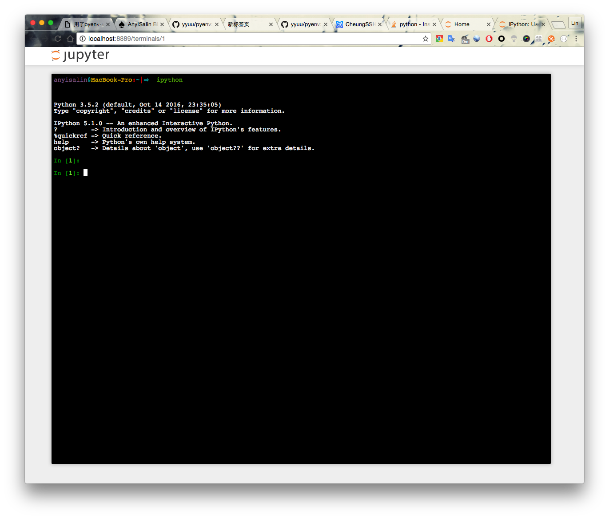

# Python 学习: 环境搭建

学习 `python` 首先需要搭建一套 `Python` 运行环境, 在 `UNIX/LINUX` 下因为`Python`本身就是系统不可缺少的一个组件, 而很多时候我系统自带 `Python` 的版本不能满足我们的需求, 我们就需要安装新版本的 `Python`.

## 为什么不能动系统自带的 `Python`

很多系统自带的程序可能依赖着自带的 `Python`, 如果对其进行更新很有可能到时系统有些服务/应用 不可用, 所以为了保险起见, 我们一般不对系统自带的 `Python` 进行修改/更新.

## `Python` 版本管理器 `Pyenv`

我们需要在一台主机上安装多版本的 `Python`, 可以使用 `Pyenv` 来管理 `Python` 的版本.

`pyenv` 是一个 `bash` 编写的程序, 能够轻松的切换 `python` 版本. 基于 `rbenv/rubybuild` 修改而来.

`pyenv` 相关资料

* [Github yyuu/pyenv](https://github.com/yyuu/pyenv)

`pyenv` 主要有几个常用的功能
 * 安装 `Python` 解释器
 * 管理 `Python` 版本
 * 管理 `Python` 虚拟环境(相当于一个独立的版本)

### 下载/安装 `pyenv`

在 `bash/zsh` 中可以通过 下面这条命令安装

* ```curl -L https://raw.githubusercontent.com/yyuu/pyenv-installer/master/bin/pyenv-installer | bash```

通过这条命令会安装 `pyenv` 以及 `pyenv-virtualenv`... 插件, 我们也可以通过 `git clone https://github.com/yyuu/pyenv.git` 到本地来自行安装.


安装完后会提示 将几条参数添加到 `~/bashrc` 中

```bash
# 这只是我自己的配置, 请按提示操作
export PATH="/Users/anyisalin/.pyenv/bin:$PATH"
eval "$(pyenv init -)"
eval "$(pyenv virtualenv-init -)"
```


### pyenv 基本用法

`pyenv` 子命令, 我们可以通过 `pyenv commands` 来查看所有的子命令.
```bash
anyisalin@MacBook-Pro:~|⇒  pyenv commands
--version
activate
commands
completions
deactivate
doctor
exec
global
help
hooks
init
install
installer
local
offline-installer
prefix
rehash
root
shell
shims
uninstall
update
version
version-file
version-file-read
version-file-write
version-name
version-origin
versions
virtualenv
virtualenv-delete
virtualenv-init
virtualenv-prefix
virtualenvs
whence
which
```


常见命令介绍

* `local`: 设置当前目录及其子目录的 `python` 版本
* `global`: 设置全局 `python` 版本 (建议不要使用, 风险太大)
* `rehash`: 一般在装完 `python` 的包之后, 都要做`rehash`
* `install`: 安装指定的 `python` 版本
* `uninstall`: 卸载指定的 `python` 版本
* `version`: 查看当前环境 `python` 版本
* `versions`: 查看当前系统上所有 `pyenv` 可用的 `python` 版本
* `virtualenv`: 新建一个独立的 `virtualenv`


使用

```bash
1. install python

anyisalin@MacBook-Pro:~|⇒  pyenv install 3.5.1 #通过指定一个 python 的版本来进行安装.

```
```bash
2. show python versions

anyisalin@MacBook-Pro:~|⇒  pyenv versions #查看当前可用的所有 python 版本
  system
  3.5.1
  3.5.2
  3.5.2/envs/python_learn
* python_learn (set by /Users/anyisalin/.python-version)
```

```bash
3. show current python version

anyisalin@MacBook-Pro:~|⇒  pyenv version #查看当前使用的 python 版本, 我这里使用的是 virtualenv, 所以并不能直接看到解释器的版本
python_learn (set by /Users/anyisalin/.python-version)
```

```bash
4. change current python version

anyisalin@MacBook-Pro:~|⇒  pyenv local 3.5.2 #修改当前环境的 python 版本为3.5.2
anyisalin@MacBook-Pro:~|⇒  pyenv version
3.5.2 (set by /Users/anyisalin/.python-version)

验证:

anyisalin@MacBook-Pro:~|⇒  pwd #当前在 ~ 目录
/Users/anyisalin
anyisalin@MacBook-Pro:~|⇒  python -V #python 版本为 3.5.2
Python 3.5.2
anyisalin@MacBook-Pro:~|⇒  cd / #切换到 / 目录
anyisalin@MacBook-Pro:/|⇒  python -V #python 版本为 2.7.10, 是 system 自带的版本
Python 2.7.10
```


**关于 virtualenv**

由于 `python` 的包依赖是基于 `site` 的, 也就意味着一台主机的 `python` 依赖是共享的, 但是这样其实很不科学, 在很多时候, 可能有多个项目依赖于某个包的不同版本, 这种时候, 我们就需要 `virtualenv` 来构建一套隔离环境.

```bash
5. virtualenv operations

anyisalin@MacBook-Pro:~|⇒  pyenv virtualenv 3.5.2 testenv #新建一个 virtualenv

命令使用方法: pyenv virtualenv $python_version $env_name

创建验证:

anyisalin@MacBook-Pro:~|⇒  pyenv versions
  system
  3.5.1
* 3.5.2 (set by /Users/anyisalin/.python-version)
  3.5.2/envs/python_learn
  3.5.2/envs/testenv  #可以看到创建的 virtualenv
  python_learn
  testenv #其实是上一条的别名

anyisalin@MacBook-Pro:~|⇒  pyenv local testenv #切换到 virtualenv
anyisalin@MacBook-Pro:~|⇒  pyenv version
  testenv (set by /Users/anyisalin/.python-version)

anyisalin@MacBook-Pro:~|⇒  pyenv uninstall testenv #卸载/删除 pyenv
```

### 使用 `ipython`, 而不是 `python`

 `ipython` 提供了非常强大的 `Python Shell`, 支持补全, 还可以使用基于 `web` 的 `notebook/jupyter notebook` 来记录笔记, 支持交互式可视化的`GUI`工具包的使用,

#### 安装 `ipython`

我们使用 `python` 的包管理工具 `pip` 来安装 `ipython` 和 `jupyter`

```bash
anyisalin@MacBook-Pro:~|⇒  pip install ipython jupyter
```

速度慢可以使用国内镜像

```
## pip 配置使用国内镜像

anyisalin@MacBook-Pro:~|⇒  [ -d ~/.pip ] || mkdir ~/.pip
anyisalin@MacBook-Pro:~|⇒  cat >> ~/.pip/pip.conf << EOF
[global]
index-url = http://mirrors.aliyun.com/pypi/simple/
trusted-host = mirrors.aliyun.com
EOF
```

```
anyisalin@MacBook-Pro:~|⇒  ipython  #输入 ipython 即可进入 python shell 环境
Python 3.5.2 (default, Oct 14 2016, 23:35:05)
Type "copyright", "credits" or "license" for more information.

IPython 5.1.0 -- An enhanced Interactive Python.
?         -> Introduction and overview of IPython's features.
%quickref -> Quick reference.
help      -> Python's own help system.
object?   -> Details about 'object', use 'object??' for extra details.

In [1]:

anyisalin@MacBook-Pro:~|⇒  jupyter-notebook #使用此命令即可进入 jupyter 的 web 界面
```




### IDE 的选择

看个人喜好, 推荐使用 `pycharm`, 请支持正版或使用社区版.
